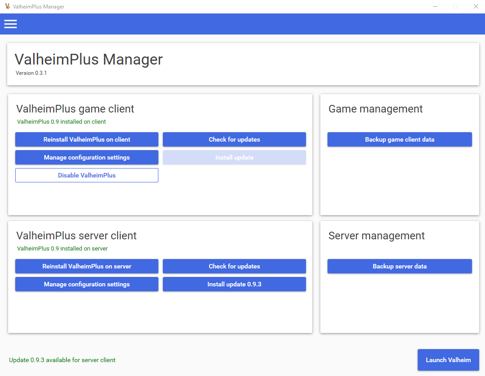
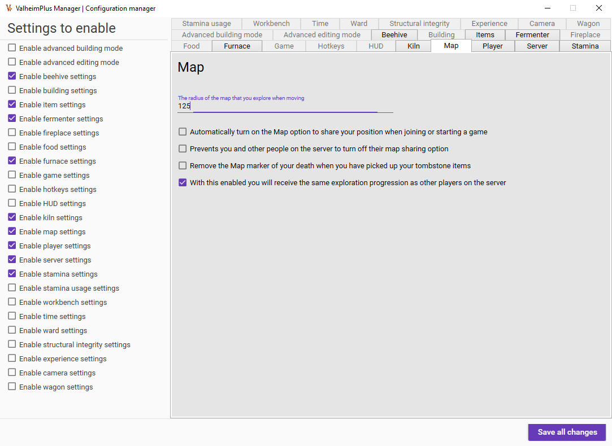

# ValheimPlus Manager
ValheimPlus Manager makes the installation and configuration of ValheimPlus on Windows a breeze!

The version of ValheimPlus Manager matches the version of ValheimPlus meaning, if the version of the manager is 0.9.8.8 it's made for the corresponding version
of ValheimPlus and fully supports it's features. The manager might work for newer/older versions as well but it's always recommended to keep matching versions.

## Features
- Automatically install ValheimPlus to your game client or server client directory
- Manage the configuration of ValheimPlus through a GUI
- Update ValheimPlus directly through ValheimPlus Manager
- Keep settings from previous versions and just add/activate new settings automagically
- Enable/disable ValheimPlus on game client, so you can join non-modded servers on the fly
- Launch Valheim(Plus) from the Manager
- In-app settings of installation paths for game client and server client
- Backup your game client data and server client data
## Roadmap
- Server list manager, join servers from the Manager
- Backup your configuration files (to send to friends for example)
- Swapping between different config files
- Management of server admins
- Uninstall ValheimPlus from game client/server client
- Automatic updates for the ValheimPlus Manager
## Requirements
- .NET 5 available for download at: https://dotnet.microsoft.com/download/dotnet/5.0/runtime
- Windows 7, Windows 8.1 or Windows 10
- x64 operating system (you have this if you have more than 4GB of RAM)
## Installation
- Download 'ValheimPlusManager.zip'
- Unzip wherever you like
- Start manager through the 'ValheimPlusManager.exe'
## Known issues
- If using a VPN where your assigned IP has been polling the Github API over 60 times in the last hour an error will be thrown. Try changing your VPN IP-address or disabling your VPN when checking for updates.
## Screenshots

## Building the project
Just download the source code, open in Visual Studio 2019 and restore the NuGet packages. Hit F5 to start running/debugging the project.
### Donations
Wanna buy me a cup of coffee?

Ethereum (ETH): 0xAC7E1beC00A3a26C623a73A3974e91f7b8A463b9
